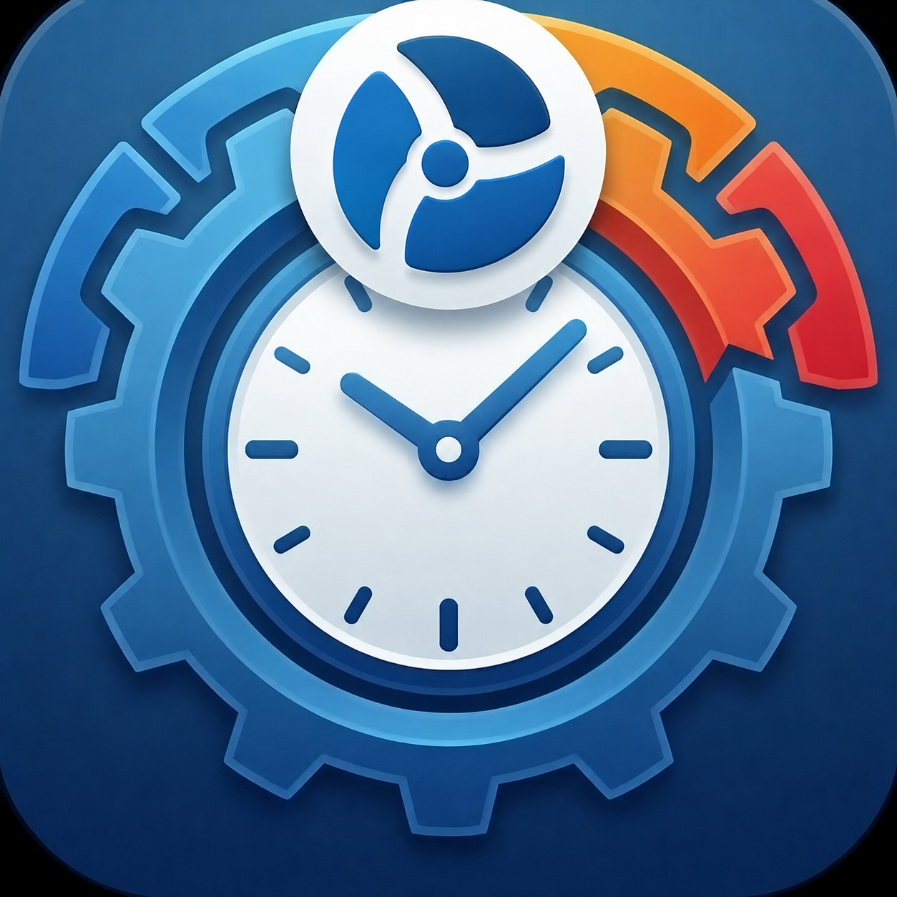

<p align="center">
  
</p>

# ShiftSalaryPlanner

Android-приложение для планирования смен, расчёта зарплаты, будильников по графику, заметок и резервного копирования данных.

Проект развивается как персональный планировщик сменной работы: календарь, несколько работ, расчётные листы, выплаты, виджеты, заметки и ИИ-помощник живут в одном приложении.

## Возможности

- Календарь смен с поддержкой нескольких работ и профилей.
- Шаблоны смен с кодом, цветом, Material-иконкой, временем начала/окончания, обедом, ночными часами и оплатой за смену.
- Системные статусы: выходной, отпуск, больничный и пользовательские статусы.
- Расчёт зарплаты по месяцу, году или диапазону дат.
- Режимы оплаты: почасовая, оклад, за смену.
- НДФЛ, ночные, РВД, больничные, отпускные, доплаты и удержания.
- Сравнение ожидаемых и фактических выплат с настраиваемым порогом расхождения.
- PDF/CSV-отчёты и история экспортов.
- Встроенные будильники по сменам: полный экран, snooze, вибрация, длительность звонка, отмена отдельных срабатываний.
- Экран “Сегодня” с настраиваемыми информационными блоками.
- Заметки по датам и сменам, медиа-вложения и виджеты заметок.
- Виджеты календаря смен и заметок.
- Резервные копии в JSON и синхронизация через Google Drive AppData.
- ИИ-помощник для команд по сменам, заметкам, будильникам и навигации.
- Гибкая настройка внешнего вида: темы, палитры, плотность, шрифты по разделам, Expressive/Glass-стили.

## Быстрый старт в приложении

После первого запуска открывается справка:

1. Создайте шаблоны смен.
2. Заполните календарь.
3. Настройте зарплату.
4. При необходимости включите будильники по сменам.

Важно: код смены обязателен. Без короткого кода вроде `Д`, `Н`, `8Д` шаблон нельзя нормально назначать в календарь и использовать в расчётах.

## Сборка

Проект использует Gradle Wrapper.

```powershell
.\gradlew.bat :app:assembleDebug
```

Для проверки Kotlin-компиляции:

```powershell
.\gradlew.bat :app:compileDebugKotlin
```

## Android SDK

Если Gradle не видит SDK, создайте локальный `local.properties`:

```properties
sdk.dir=C\:\\Users\\<user>\\AppData\\Local\\Android\\Sdk
```

`local.properties` не должен попадать в Git.

## Stable debug signing

В debug-сборках используется стабильный debug-keystore, чтобы SHA-1 не менялся между устройствами и установками из Android Studio.

По умолчанию Gradle ищет файл:

```text
%USERPROFILE%\.android\shift-salary-stable-debug.keystore
```

Можно переопределить путь в `local.properties`:

```properties
stableDebug.storeFile=C\:\\path\\to\\stable-debug.keystore
stableDebug.storePassword=android
stableDebug.keyAlias=androiddebugkey
stableDebug.keyPassword=android
```

Посмотреть SHA-1:

```powershell
.\gradlew.bat :app:printSigningSha1
```

Keystore-файлы не должны храниться в Git.

## Резервные копии

Приложение поддерживает:

- ручной экспорт/импорт JSON;
- Google Drive AppData;
- автозагрузку по расписанию, если она включена пользователем.

В бэкап сохраняются график, шаблоны смен, профили, работы, настройки зарплаты, внешний вид, виджеты, будильники, заметки и сервисные настройки.

## ИИ-помощник

Ассистент умеет работать в локальном режиме и через внешние API-провайдеры:

- GigaChat;
- Gemini;
- OpenAI.

API-ключи пользователь указывает в настройках приложения. Ключи не хранятся в репозитории.

## Структура проекта

```text
app/src/main/java/com/vigilante/shiftsalaryplanner/
  alarms/       будильники и full-screen ringing
  app/          основная Compose-точка входа и действия приложения
  data/         Room database и DAO
  domain/       доменная логика календаря, смен, sick/overtime
  payroll/      расчёты зарплаты и расчётные листы
  settings/     DataStore-настройки
  ui/           Compose UI по разделам
  widget/       Android App Widgets
```
